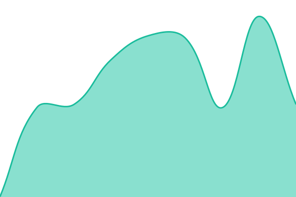
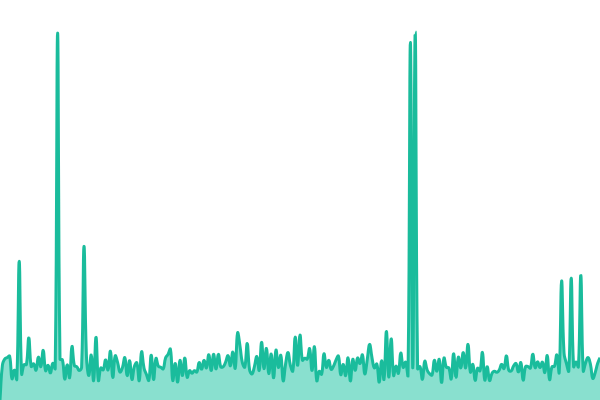
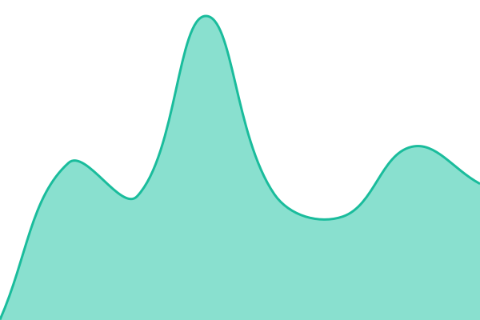
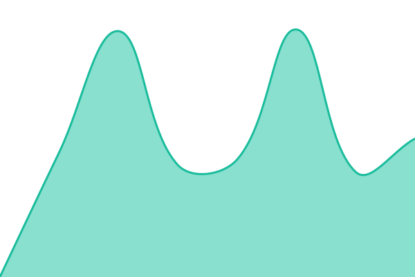

# [📈 Live Status](https://txitxo0.github.io/upptime): <!--live status--> **🟩 All systems operational**

This repository contains the open-source uptime monitor and status page for [txitxo0](https://txitxo0.github.io/upptime), powered by [Upptime](https://github.com/upptime/upptime).

With [Upptime](https://upptime.js.org), you can get your own unlimited and free uptime monitor and status page, powered entirely by a GitHub repository. We use [Issues](https://github.com/txitxo0/upptime/issues) as incident reports, [Actions](https://github.com/txitxo0/upptime/actions) as uptime monitors, and [Pages](https://txitxo0.github.io/upptime) for the status page.

<!--start: status pages-->
<!-- This summary is generated by Upptime (https://github.com/upptime/upptime) -->
<!-- Do not edit this manually, your changes will be overwritten -->
<!-- prettier-ignore -->
| URL | Status | History | Response Time | Uptime |
| --- | ------ | ------- | ------------- | ------ |
|  ha_duckdns | 🟩 Up | [ha-duckdns.yml](https://github.com/txitxo0/upptime/commits/HEAD/history/ha-duckdns.yml) | 

 396ms
     
 | 

<a href="https://txitxo0.github.io/upptime/history/ha-duckdns">94.39%</a>
    

|  ha_pangolin | 🟩 Up | [ha-pangolin.yml](https://github.com/txitxo0/upptime/commits/HEAD/history/ha-pangolin.yml) | 

 526ms
     
 | 

<a href="https://txitxo0.github.io/upptime/history/ha-pangolin">98.46%</a>
    

|  headscale | 🟩 Up | [headscale.yml](https://github.com/txitxo0/upptime/commits/HEAD/history/headscale.yml) | 

 418ms
     
 | 

<a href="https://txitxo0.github.io/upptime/history/headscale">100.00%</a>
    

|  headplane | 🟩 Up | [headplane.yml](https://github.com/txitxo0/upptime/commits/HEAD/history/headplane.yml) | 

 616ms
     
 | 

<a href="https://txitxo0.github.io/upptime/history/headplane">100.00%</a>
    

|  emby | 🟩 Up | [emby.yml](https://github.com/txitxo0/upptime/commits/HEAD/history/emby.yml) | 

 987ms
     
 | 

<a href="https://txitxo0.github.io/upptime/history/emby">100.00%</a>
    

|  immich | 🟩 Up | [immich.yml](https://github.com/txitxo0/upptime/commits/HEAD/history/immich.yml) | 

 579ms
     
 | 

<a href="https://txitxo0.github.io/upptime/history/immich">100.00%</a>
    

|  monitor | 🟩 Up | [monitor.yml](https://github.com/txitxo0/upptime/commits/HEAD/history/monitor.yml) | 

 430ms
     
 | 

<a href="https://txitxo0.github.io/upptime/history/monitor">100.00%</a>
    

<!--end: status pages-->

[**Visit our status website →**](https://txitxo0.github.io/upptime)

## 📄 License

- Powered by: [Upptime](https://github.com/upptime/upptime)
- Code: [MIT](./LICENSE) © [Anand Chowdhary](https://anandchowdhary.com), supported by [Pabio](https://pabio.com)
- Data in the `./history` directory: [Open Database License](https://opendatacommons.org/licenses/odbl/1-0/)
